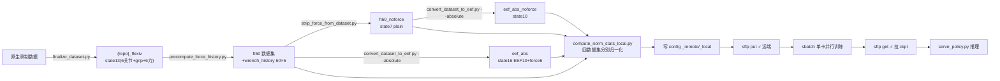

# FA-openpi 完整工作流：数据集 → config → 远端训练 → 推理 serve

> 本文汇总 2026-08 多轮会话沉淀的完整流程，所有命令均在本项目聊天记录中实际执行验证过。
> 日期：2026-08-22　｜　核心原则：**EEF 一律走 V2 方案**（绝对 EEF 数据集 + 训练时合成 delta），v1（逐帧 delta）已废弃。

---

## 0. 总览



**四个训练数据集（最终产物）**：

| 数据集 | state 维 | action 维 | 用途 | 归一化 config |
|---|---|---|---|---|
| `total_2task_flexiv_ft60` | 13 (6关节+grip+6力) | 7 delta | force joint / dual | `pi05_force_total_task_joint_only_local` |
| `total_2task_flexiv_ft60_noforce` | 7 | 7 delta | plain joint | `pi05_plain_total_task_joint` |
| `total_2task_flexiv_eef_abs` | 16 (EEF10+force6) | **10 绝对** | **force EEF v2** | `pi05_force_total_task_eef_v2_remote` |
| `total_2task_flexiv_eef_abs_noforce` | 10 | **10 绝对** | **plain EEF v2** | `pi05_plain_total_task_eef_v2_remote` |

> ⚠️ `eef_rot6d(_noforce)` 是 v1（逐帧 delta，爬行根因），仅存档，新工作一律用 `eef_abs` 系列。

---

## 1. 环境与路径约定

| 项 | 值 |
|---|---|
| 本地环境 | `source ~/miniconda3/etc/profile.d/conda.sh && conda activate rlinf` |
| 环境要点 | **所有数据处理/训练/serve 脚本都必须用 rlinf 环境跑**（含 pyarrow/flax 0.10.2/jax 0.5.3；系统 base python 无 pyarrow）；亦可直接 `/home/sfy/miniconda3/envs/rlinf/bin/python` |
| PYTHONPATH | 必须 `PYTHONPATH=src`（否则 import 到 `/mnt/hdd/sfy/openpi` 另一个仓库） |
| 本地代码 | `/mnt/hdd/sfy/FA-openpi` |
| 本地数据集 | `/mnt/hdd/sfy/datasets/` |
| 远端主机 | `ssh -J sfy@10.96.45.13 junjie008@mae-cae1-p4103.dynip.ntu.edu.sg` |
| 远端代码 | `/data/group1/junjie008/FA-openpi` |
| 远端数据集 | `/data/group1/junjie008/datasets/` |
| 远端 GPU | 2x RTX PRO 6000 96G |

---

## 2. 数据集处理链

### 2.1 原生录制 → lerobot/flexiv 格式

原生录制目录（如 `data_piper_multi_record_cam_act`）先转 flexiv 格式：

```bash
cd /mnt/hdd/sfy/FA-openpi && source ~/miniconda3/etc/profile.d/conda.sh && conda activate rlinf
python scripts/finalize_dataset.py /mnt/hdd/sfy/datasets/<原生repo>
# 输出 {repo}_flexiv，完成: force 合并到 observation.state (7→13维) + 图像嵌入 parquet
```

### 2.2 force history（ft60，仅 force 线需要）

```bash
python scripts/precompute_force_history.py \
    --src /mnt/hdd/sfy/datasets/<repo>_flexiv \
    --dst /mnt/hdd/sfy/datasets/<repo>_ft60 \
    --history-steps 60
# 复制源数据集并在每个 parquet 新增 observation.wrench_history [T,60,6] 列
# （force 从 observation.state[7:13] 切片；episode 边界零填充；原数据集不动）
```

> 说明：`finalize_dataset.py` 已完成 force 合并（原生 `observation.force` 独立列 → state 7→13 维）
> 与图像嵌入（videos → parquet 内 JPEG bytes）。本步只补 60 帧力历史。

### 2.3 去力（plain 线需要）

```bash
python scripts/strip_force_from_dataset.py \
    --input /mnt/hdd/sfy/datasets/total_2task_flexiv_ft60 \
    --output /mnt/hdd/sfy/datasets/total_2task_flexiv_ft60_noforce
# state 13 → 7（只留 6 关节+grip）
```

### 2.4 joint → EEF（⚠️ 必须用 V2 `--absolute`）

```bash
# plain EEF v2（从 noforce 转）
python scripts/convert_dataset_to_eef.py \
    --input /mnt/hdd/sfy/datasets/total_2task_flexiv_ft60_noforce \
    --output /mnt/hdd/sfy/datasets/total_2task_flexiv_eef_abs_noforce \
    --tool-extension 0.211 --absolute

# force EEF v2（从 ft60 转，state 16 = EEF10 + force6）
python scripts/convert_dataset_to_eef.py \
    --input /mnt/hdd/sfy/datasets/total_2task_flexiv_ft60 \
    --output /mnt/hdd/sfy/datasets/total_2task_flexiv_eef_abs \
    --tool-extension 0.211 --absolute
```

**V2 语义（为什么必须 --absolute）**：
- parquet 里 action 存**绝对 EEF** `[xyz3, rot6d6, grip1]`；delta 由**训练侧** `EefDeltaActions` 相对 chunk 基准（当前帧 state）合成，chunk 内保留完整轨迹 ramp
- rot6d 合成用矩阵：`Rd = Rs^T @ Ra`（Gram-Schmidt，float64 内部），grip 绝对
- `--absolute` 还会同步修正 meta features（action shape=[10]，EEF 列名）并**删除复制的旧 norm_stats.json**
- **v1 教训**：旧版默认逐帧 delta 会把 30 步轨迹压成常量 gap → 部署爬行（30 步 ~2cm）；v2 验证 30 帧窗口 max|Δxyz|=0.055m（25 倍恢复）

### 2.5 归一化（四个数据集分别算）

```bash
# ⚠️ 必须 JAX_PLATFORMS=cpu（GPU 上 JAX 预分配 75% 显存会 OOM；计算瓶颈在 CPU，~15min/数据集）
# ⚠️ tyro 必须用命名参数（--config-name / --local-repo-dir）
cd /mnt/hdd/sfy/FA-openpi && source ~/miniconda3/etc/profile.d/conda.sh && conda activate rlinf

JAX_PLATFORMS=cpu PYTHONPATH=src python scripts/compute_norm_stats_local.py \
    --config-name pi05_plain_total_task_joint \
    --local-repo-dir /mnt/hdd/sfy/datasets/total_2task_flexiv_ft60_noforce

JAX_PLATFORMS=cpu PYTHONPATH=src python scripts/compute_norm_stats_local.py \
    --config-name pi05_force_total_task_joint_only_local \
    --local-repo-dir /mnt/hdd/sfy/datasets/total_2task_flexiv_ft60

JAX_PLATFORMS=cpu PYTHONPATH=src python scripts/compute_norm_stats_local.py \
    --config-name pi05_plain_total_task_eef_v2_remote \
    --local-repo-dir /mnt/hdd/sfy/datasets/total_2task_flexiv_eef_abs_noforce

JAX_PLATFORMS=cpu PYTHONPATH=src python scripts/compute_norm_stats_local.py \
    --config-name pi05_force_total_task_eef_v2_remote \
    --local-repo-dir /mnt/hdd/sfy/datasets/total_2task_flexiv_eef_abs
```

输出写入各自数据集根目录 `norm_stats.json`：
- plain 系：`state` + `actions`
- force 系：`state` + `actions` + `ft_state(360)` + `force_target(6)`

### 2.6 验证要点

```bash
# norm_stats.json 结构：顶层只有一个键 "norm_stats"，其下才是 state/actions/...
python3 -c "import json; ns=json.load(open('<ds>/norm_stats.json'))['norm_stats']; print({k: len(v['q01']) for k,v in ns.items()})"
# 期望: plain {state:7|10, actions:7|10} / force {state:13|16, actions:7|10, ft_state:360, force_target:6}

# meta 检查: action shape 与列名
cat <ds>/meta/info.json | python3 -m json.tool | head

# EEF delta 量级（v2 合理值）: actions q01/q99 xyz ≈ ±0.11~0.17 m（v1 只有 ±0.007）
# state 为绝对 EEF 范围；force 版 ft_state q01 含重力 (~-17.6)
```

---

## 3. 写 config（src/openpi/training/config.py）

### 命名规则（固定）

`pi05_{plain|force}_{任务}_{joint|eef|eef_joint}_{local|remote}`

- `plain` = 无 force（Pi0Config）；`force` = Pi0ForceConfig
- `eef` = EEF 模型（action_dim=10）；`joint`/`joint_only` = 纯关节；`eef_joint` = dual（serve 不转 EEF）
- `_remote` → repo_id 指 `/data/group1/junjie008/datasets/...`（远端训练）；`_local` → `/mnt/hdd/sfy/datasets/...`（本地）。**模型结构完全一致**，本地推理可用 `_remote` config + `--norm-stats-dir` 指本地数据集。

### EEF v2 关键字段（LeRobotPiperDataConfig）

```python
data=LeRobotPiperDataConfig(
    repo_id="/data/group1/junjie008/datasets/total_2task_flexiv_eef_abs_noforce",
    use_delta_joint_actions=False,   # 互斥开关之一
    use_eef_delta_actions=True,      # EEF v2 开关（两者同 True 直接 raise ValueError）
    action_dim=10,
    base_config=DataConfig(prompt_from_task=True),
),
```

### force v2 关键字段（Pi0ForceConfig + data）

```python
model=pi0_force.Pi0ForceConfig(
    pi05=True, action_horizon=30,
    use_force=True, predict_force=True,
    control_action_dim=10, force_start_idx=10, force_dim=6,
    force_history_frames=2, use_ft_history=True, ft_history_steps=60,
    ft_input_dim=360, ft_output_dim=256, ft_encoder_type="mlp", ft_num_tokens=16,
    grad_route_mode="three_stage",
    action_loss_weight=0.9, force_loss_weight=0.01, force_frame_spike_weight=2.0,
    use_eef_loss=False, num_experts=4, num_top_k=1,
),
data=LeRobotPiperDataConfig(
    repo_id="/data/group1/junjie008/datasets/total_2task_flexiv_eef_abs",
    use_delta_joint_actions=False, use_eef_delta_actions=True,
    use_force_data=True, predict_force=True, force_in_state=True,
    use_ft_history=True, ft_history_steps=60,
    action_dim=10,
    base_config=DataConfig(prompt_from_task=True),
),
```

其余通用：`batch_size` 默认 32（sbatch 命令行 `--batch_size=8` 覆盖）、`CosineDecaySchedule(warmup 2000, peak 5e-5, decay 1M, decay_lr 5e-5)`、`AdamW(clip_gradient_norm=1.0)`、`weight_loader=CheckpointWeightLoader("gs://openpi-assets/checkpoints/pi05_base/params")`（force 用 `Pi0ForceWeightLoader`）、`num_train_steps=40_000`、`save_interval=2000`、`keep_period=10000`。

**登记**：新增 config 必须同步登记 `docs/config_checkpoint_serve_map.md`（§1 表 + §2 复制最近似 serve 指令改三处）。

---

## 4. 远端挂训练（不用 git）

### 4.1 同步代码与数据集（sftp put -r，只动第一层级文件夹）

```bash
sftp -J sfy@10.96.45.13 junjie008@mae-cae1-p4103.dynip.ntu.edu.sg
# 代码：只 put 改动过的第一层级文件夹（覆盖式，不会删远端多余文件）
cd /data/group1/junjie008/FA-openpi
put -r /mnt/hdd/sfy/FA-openpi/src        # config.py / transforms.py / piper_fk_jax.py 等
put -r /mnt/hdd/sfy/FA-openpi/scripts    # convert/归一化/train/serve 等脚本
put -r /mnt/hdd/sfy/FA-openpi/docs
put /mnt/hdd/sfy/FA-openpi/job_eef_v2_parallel.sbatch   # 顶层新增 sbatch 单文件 put
# 数据集：
cd /data/group1/junjie008/datasets
put -r /mnt/hdd/sfy/datasets/total_2task_flexiv_eef_abs_noforce
put -r /mnt/hdd/sfy/datasets/total_2task_flexiv_eef_abs
exit
```

> 规则：**绝不 put -r 整个 FA-openpi**；只 put 改动的第一层级文件夹；不拆小文件散 put。
> 远端删除过的旧文件（如已废弃 sbatch）需要手动 `rm`。

### 4.2 并行训练 sbatch 写法（单卡并行模板）

参考 `job_eef_v2_parallel.sbatch`（结构同 `job_pi05_chain_eef_force.sbatch`）：

```bash
#SBATCH --job-name=eef_v2_par        # ← 只改 job-name / output / error 名称
#SBATCH --partition=debug            # ← 其余头部不动
#SBATCH --nodes=1 --ntasks=1 --gres=gpu:1
#SBATCH --cpus-per-task=16 --mem=192G --time=72:00:00
#SBATCH --output=/data/group1/junjie008/FA-openpi/logs/eef_v2_par_%j.out
#SBATCH --error=/data/group1/junjie008/FA-openpi/logs/eef_v2_par_%j.err

export XLA_PYTHON_CLIENT_PREALLOCATE=false   # ⚠️ 必须在所有阶段前（spawn worker OOM 教训）
export XLA_PYTHON_CLIENT_MEM_FRACTION=0.45   # 单卡内并行: 每进程 45% 显存

PARALLEL_COMMON="--batch_size=8 --num_train_steps=40000 --save_interval=2000 --keep_period=10000 --log_interval=10 --num_workers=4"
python -u scripts/train.py pi05_plain_total_task_eef_v2_remote --exp-name=eef_v2_plain --overwrite $PARALLEL_COMMON 2>&1 | tee logs/eef_v2_plain.log &
P_PL=$!
python -u scripts/train.py pi05_force_total_task_eef_v2_remote  --exp-name=eef_v2_force  --overwrite $PARALLEL_COMMON 2>&1 | tee logs/eef_v2_force.log &
P_FT=$!
wait $P_PL $P_FT
```

> ⚠️ force 版是 Pi0Force 全参 + ft_history，显存比 plain 大；若 force 侧 OOM，调 plain 0.35 / force 0.55，或降 force bs=4。

### 4.3 提交与监控

```bash
ssh -J sfy@10.96.45.13 junjie008@mae-cae1-p4103.dynip.ntu.edu.sg
cd /data/group1/junjie008/FA-openpi
sbatch job_eef_v2_parallel.sbatch
squeue -u junjie008
tail -f logs/eef_v2_par_*.out
```

---

## 5. 拉 ckpt + serve 推理

### 5.1 拉 checkpoint（sftp get -r）

```bash
sftp -J sfy@10.96.45.13 junjie008@mae-cae1-p4103.dynip.ntu.edu.sg
get -r /data/group1/junjie008/FA-openpi/checkpoints/pi05_eef/39999 /mnt/hdd/sfy/FA-openpi/checkpoints/pi05_eef/39999
# 或拉日志: get -r /data/group1/junjie008/FA-openpi/logs/total_2task_pi05_chain_*.log /mnt/hdd/sfy/FA-openpi/remote_logs/logs/
exit
```

ckpt 目录结构：`_CHECKPOINT_METADATA`（含 init 时间戳）+ `params/`（权重）+ `train_state/`；v2 的 `assets/` 为空（norm_stats 走 `--norm-stats-dir`）。

### 5.2 serve 启动指令（权威版在 `指令.md`，共 6 块）

统一前置：`cd /mnt/hdd/sfy/FA-openpi && source ~/miniconda3/etc/profile.d/conda.sh && conda activate rlinf`

**v2 plain EEF（关键示例）**：

```bash
CUDA_VISIBLE_DEVICES=0 XLA_PYTHON_CLIENT_PREALLOCATE=false PYTHONPATH=src \
python scripts/serve_policy.py \
    --norm-stats-dir=/mnt/hdd/sfy/datasets/total_2task_flexiv_eef_abs_noforce \
    --port=8000 \
    --action-space=EEF --action-rep=abs \
    policy:checkpoint \
    --policy.config=pi05_plain_total_task_eef_v2_remote \
    --policy.dir=/mnt/hdd/sfy/FA-openpi/checkpoints/pi05_eef/39999
```

**v2 force EEF**：同结构，改 `--norm-stats-dir=.../total_2task_flexiv_eef_abs`、`--policy.config=pi05_force_total_task_eef_v2_remote`、`--policy.dir=.../checkpoints/total_eef/39999`；**client 必须发 `observation/wrench_history` (60×6)**。

### 5.3 serve 特殊点（务必遵守）

1. **v2 必须 `--action-rep=abs`**：模型输出侧已有 `EefAbsoluteActions` 把 delta 还原成绝对 EEF；若误用 `delta` 会二次合成爆炸（实测 max Δjoint 154 rad → abs 后 0.07 rad）
2. **v2 不加 `--gap-rate`**（训练目标已是真实 ramp，外推会超调）；`--gap-rate=0.098` 是 v1 专属补丁
3. `XLA_PYTHON_CLIENT_PREALLOCATE=false` 必带；端口 8000；一次只开一个
4. 就绪标志 `server listening on 0.0.0.0:8000`；首帧 JIT ~16s（模型+IK），真机前先热身一帧
5. norm_stats 加载报 `/data/group1/... not found` 属预期（remote config 的 fallback 链）
6. **IK 关节限位已修复（commit f48bbc0）**：`piper_fk_jax.py` 内置 URDF 限位（q1 ±150°=±2.618 rad，q2 [0,3.14]，q3 [-2.967,0]，q4 ±1.745，q5 ±1.22，q6 ±2.967），迭代每步 clip，不会再解过头。远端 serve 前必须同步该文件
7. force 模型 client 发 wrench_history；plain 不发
8. 离线验证方法论（不占 server 端口）：`sys.path.insert(0,'scripts') + import serve_policy as sp` → `create_trained_policy(config, ckpt, norm_stats=ns, output_norm_stats=sp._filter_output_norm_stats(ns))` → wrapper.infer（与线上同代码路径）

---

## 6. 特殊点/坑清单

| 项 | 说明 |
|---|---|
| v1 数据集爬行根因 | 旧 convert 默认逐帧 delta 压扁 30 步轨迹；v2 `--absolute` + 训练侧 `EefDeltaActions` 治本 |
| EEF 冲天（d839622 已修） | 旧 serve delta 模式链式复合；改为单基准（推理时刻当前 EEF 位姿），不累加 |
| v2 serve 语义 | `--action-rep=abs`（模型输出已是绝对 EEF），不加 `--gap-rate` |
| IK 限位（f48bbc0 已修） | eef_ik 每步 clip 到官方 URDF 限位，q1 不再解到 165°+ |
| norm_stats.json 结构 | 顶层只有 `norm_stats` 键，其下 `state`/`actions`/`ft_state`/`force_target`；勿按裸 dict 读 |
| 归一化 OOM | 必须 `JAX_PLATFORMS=cpu`（GPU 预分配机制）；~15min/数据集 |
| tyro 参数 | `compute_norm_stats_local.py` 必须命名参数 `--config-name/--local-repo-dir` |
| sftp | 先 cd 远端父目录再 put -r；不支持 mkdir -p（先 ssh 建目录）；put -r 只覆盖+新增，不删远端文件 |
| 代码同步 | 只 put -r 第一层级改动文件夹（src/scripts/docs + 顶层 sbatch），绝不 put 整个 repo |
| 训练并行 | 单 sbatch 申请 1 卡，脚本内两进程各 45% 显存；`XLA_PYTHON_CLIENT_PREALLOCATE=false` 在最前 |
| config 互斥 | `use_eef_delta_actions` 与 `use_delta_joint_actions` 同 True 直接 raise |
| dual（eef_joint） | 本质 joint-only，serve 不转 EEF；EEF 工作完全不用考虑它 |
| 回归检查 | 改 config/transforms 后用 git worktree 对比旧 config 的 data_transforms 逐位一致 |

---

## 附：权威参考文件

- `指令.md`：6 条 serve 启动指令（v1 plain EEF / v2 plain EEF / joint / dual / joint_only / v2 force EEF）
- `docs/config_checkpoint_serve_map.md`：config ↔ ckpt ↔ serve ↔ norm_stats 权威登记表 + 坑表
- `docs/EEF_rot6d_workflow.md`：rot6d 表示背景与 v1 工作流（历史存档）
- `/memories/repo/eef-serve-chunk-runaway.md`：EEF 问题根因全记录（含 v2 修复与 IK 限位）
